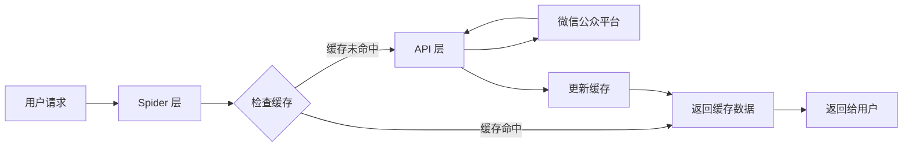
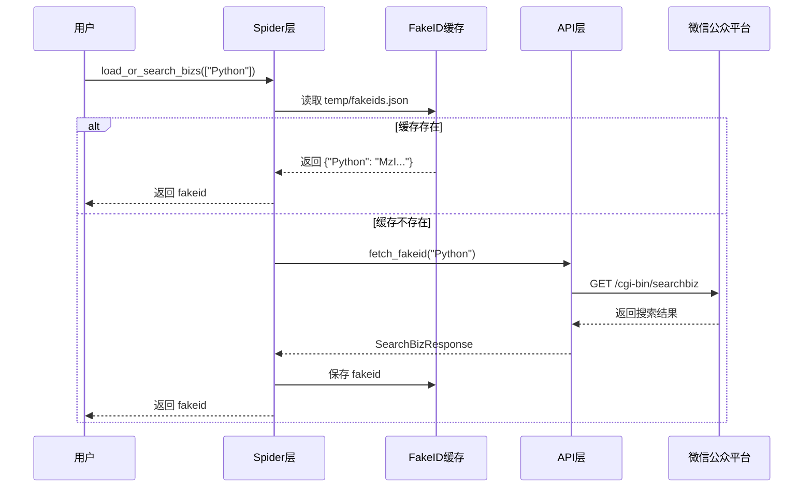
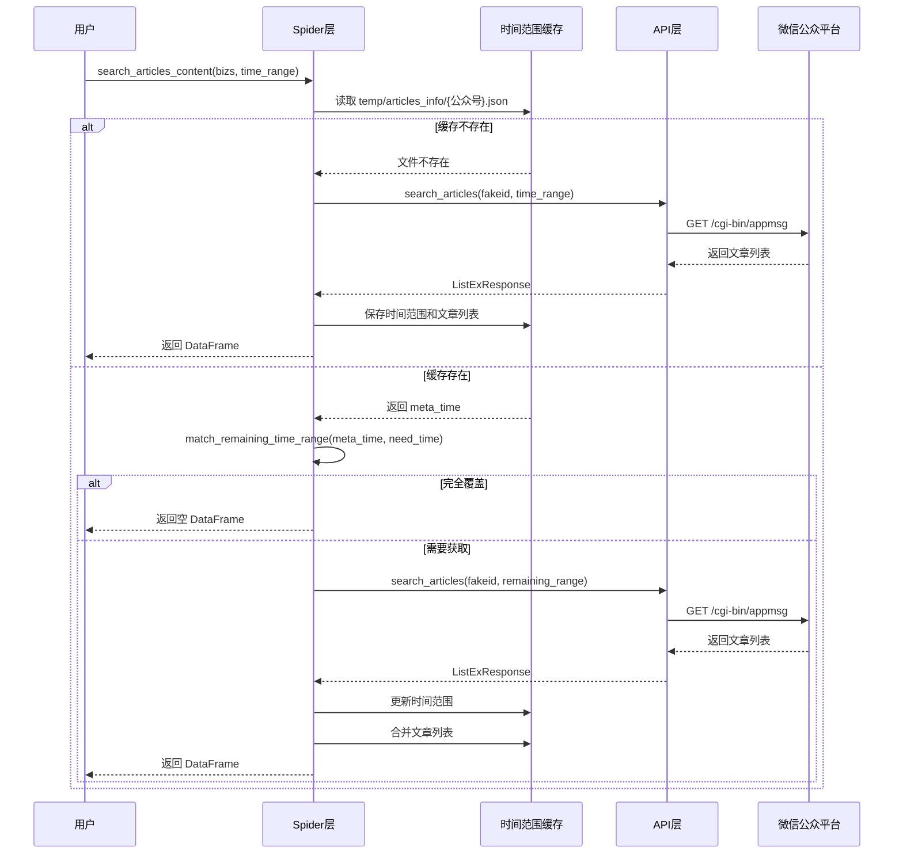
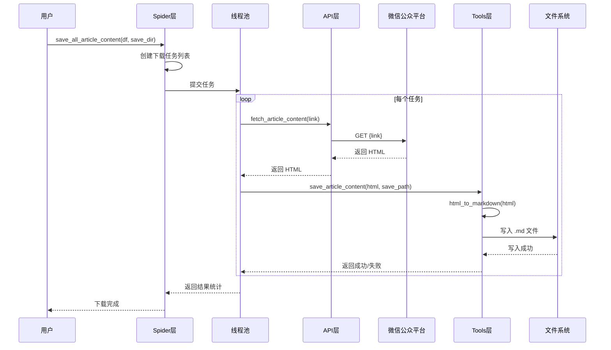
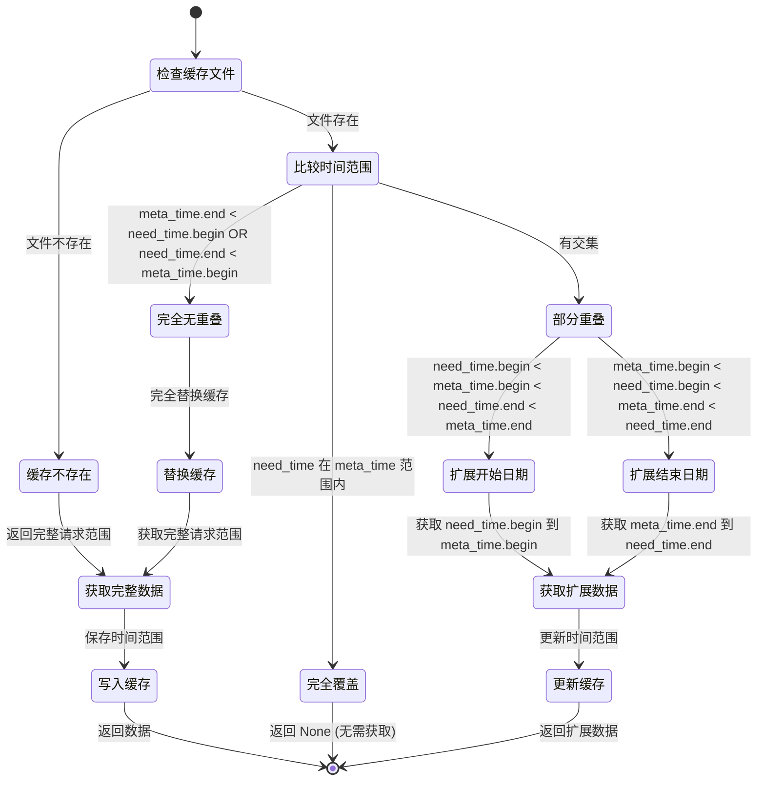
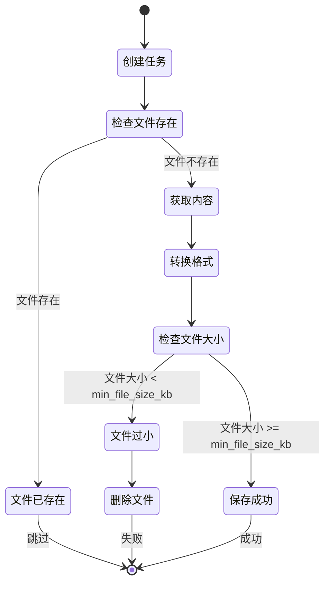
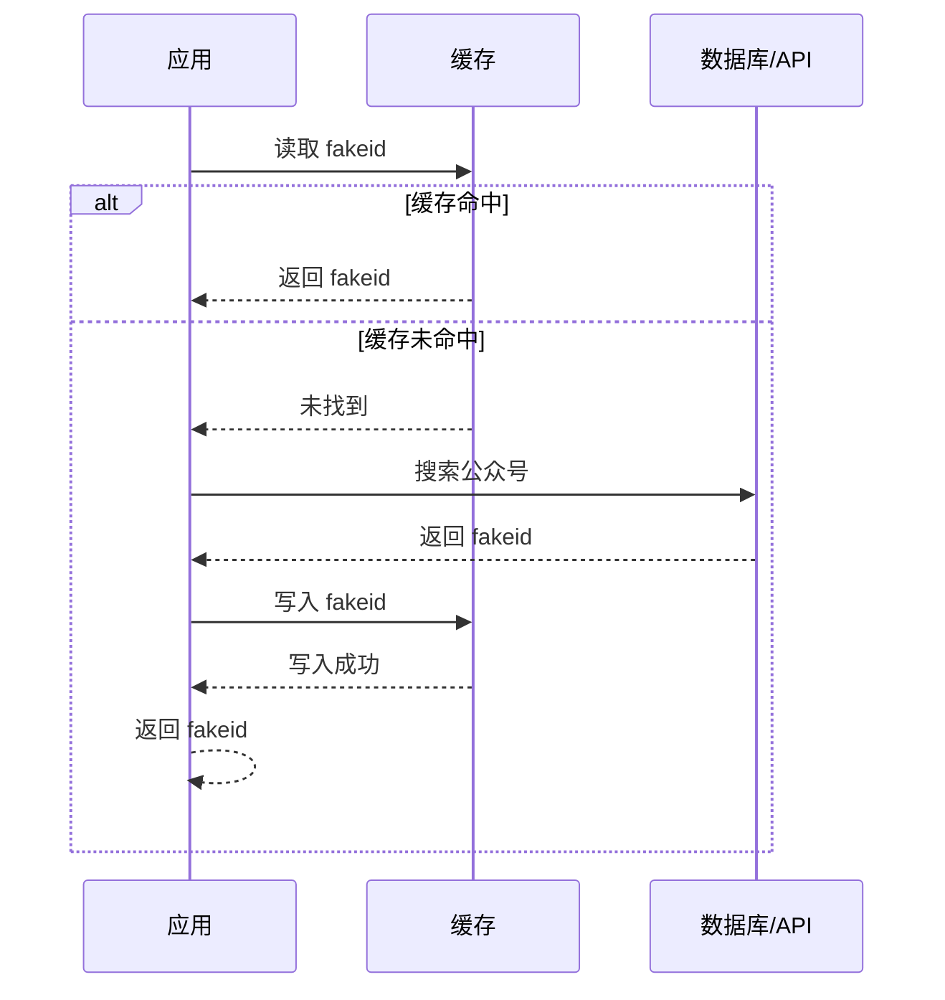
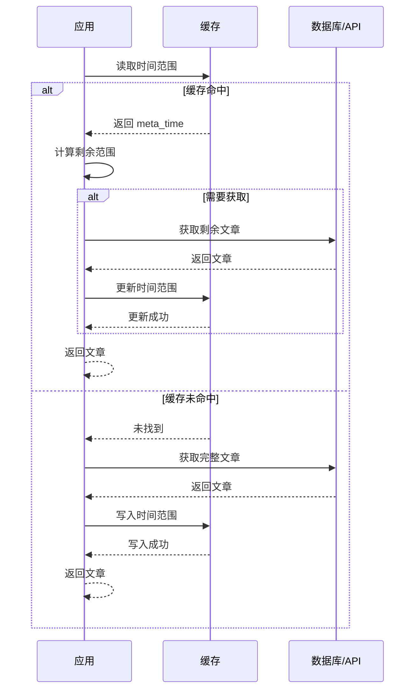
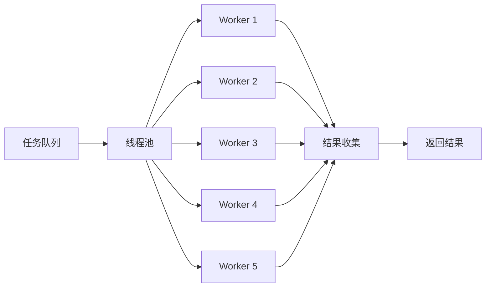
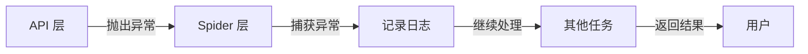

# 数据流动与状态管理

## 概述

本文档详细描述 `wxmp` 项目中的数据流动和状态管理机制，包括缓存策略、数据流转过程、状态转换等核心概念。

---

## 数据流动

### 1. 整体数据流



### 2. FakeID 获取流程



**数据格式**:

```json
{
  "Python编程": "MzI...",
  "机器学习": "MzI...",
  "数据分析": "MzI..."
}
```

### 3. 文章列表获取流程



**数据格式**:

```json
{
  "begin": "2024-01-01",
  "end": "2024-06-30"
}
```

```csv
title,link,create_time,cover,digest
文章标题1,https://mp.weixin.qq.com/s/xxx1,2024-01-01 10:00:00,https://...,摘要1
文章标题2,https://mp.weixin.qq.com/s/xxx2,2024-01-02 10:00:00,https://...,摘要2
```

### 4. 文章内容下载流程



**数据格式**:

```markdown
---
title: 文章标题
date: 2024-01-01
link: https://mp.weixin.qq.com/s/xxx
account: 公众号名
summary: 文章摘要
---

文章内容...


## 标题

内容...
```

---

## 状态管理

### 1. 缓存状态机



### 2. 时间范围匹配算法

```python
def match_remaining_time_range(
    meta_time: TimeRange, need_time: TimeRange
) -> tuple[TimeRange, TimeRange]:
    """
    时间范围匹配算法

    四种情况：
    1. 完全无重叠 → 返回完整请求范围，替换缓存
    2. 部分重叠（需要扩展结束） → 返回扩展部分，更新缓存结束时间
    3. 部分重叠（需要扩展开始） → 返回扩展部分，更新缓存开始时间
    4. 完全覆盖 → 返回 None，无需获取
    """
```

**可视化示例**:

```
情况 1: 完全无重叠
meta_time: |====|
need_time:           |====|
remaining:           |====|
new_meta:            |====|

情况 2: 部分重叠（扩展结束）
meta_time: |====|
need_time:  |========|
remaining:      |====|
new_meta:  |========|

情况 3: 部分重叠（扩展开始）
meta_time:      |====|
need_time: |========|
remaining: |====|
new_meta: |========|

情况 4: 完全覆盖
meta_time: |========|
need_time:  |====|
remaining: None
new_meta: |========|
```

### 3. 下载任务状态



---

## 缓存策略

### 1. Cache Aside 模式

**FakeID 缓存**:



**时间范围缓存**:



### 2. 缓存文件结构

```
temp/
├── fakeids.json                          # FakeID 缓存
├── articles_info/                        # 文章信息目录
│   ├── Python编程.json                   # 时间范围缓存
│   ├── Python编程.csv                    # 文章列表
│   ├── 机器学习.json
│   └── 机器学习.csv
└── article_content/                      # 文章内容目录
    ├── Python编程/
    │   ├── 文章1.md
    │   ├── 文章2.md
    │   └── ...
    └── 机器学习/
        ├── 文章1.md
        └── ...
```

### 3. 缓存一致性

**写入策略**:
- 先写入临时文件
- 原子性重命名
- 避免写入过程中读取到不完整数据

**读取策略**:
- 读取前检查文件是否存在
- 验证文件格式是否正确
- 异常时回退到无缓存状态

---

## 数据模型

### 1. TimeRange

```python
class TimeRange(BaseModel):
    """文章时间范围，用于缓存管理"""
    begin: datetime
    end: datetime = datetime.today()

    @field_serializer("begin", "end")
    def serialize_datetime(self, dt: datetime) -> str:
        """将 datetime 对象序列化为 YYYY-MM-DD 格式字符串"""
        return dt.strftime("%Y-%m-%d")
```

**状态转换**:

```
初始状态: begin=2024-01-01, end=2024-12-31
         ↓
扩展结束: begin=2024-01-01, end=2025-12-31
         ↓
扩展开始: begin=2023-01-01, end=2025-12-31
```

### 2. ArticleDownloadTask

```python
class ArticleDownloadTask(NamedTuple):
    """文章下载任务"""
    url: str
    title: str
    save_dir: Path
    save_file: Literal["md", "html"] = "md"
    max_retries: int = 3
    timeout: int = 30
    date_str: str = ""
    account_name: str = ""
    digest: str = ""
    min_file_size_kb: int = 3
```

**任务状态**:

```
创建 → 检查文件 → 获取内容 → 转换格式 → 检查大小 → 完成
  ↓        ↓          ↓          ↓          ↓
 跳过    失败       失败       失败       失败
```

---

## 并发控制

### 1. 线程池模型



### 2. 并发参数

| 参数 | 默认值 | 说明 |
|------|--------|------|
| max_workers | 5 | 最大并发数 |
| timeout | 30 | 单个请求超时时间（秒） |
| max_retries | 3 | 最大重试次数 |

### 3. 并发安全

- 每个任务独立处理
- 文件写入使用原子操作
- 避免共享状态

---

## 错误处理

### 1. 错误传播



### 2. 错误恢复

- **Token 失效**: 重新获取 token
- **网络错误**: 自动重试（最多 3 次）
- **文件写入失败**: 删除临时文件，记录错误
- **数据解析失败**: 跳过该条数据，继续处理

---

## 性能优化

### 1. 缓存优化

- FakeID 缓存：避免重复搜索
- 时间范围缓存：避免重复获取
- 增量更新：只获取新数据

### 2. 并发优化

- 多线程并发下载
- 连接复用（Session）
- 异步获取文章内容

### 3. 数据处理优化

- 使用 Pandas 批量处理
- 去重和排序优化
- 内存友好设计

---

## 监控与日志

### 1. 关键指标

- 缓存命中率
- 下载成功率
- 平均下载时间
- 错误率

### 2. 日志记录

```python
from loguru import logger

logger.info(f"从缓存加载fakeids: {cache_file}")
logger.info(f"公众号 {nickname} 剩余时间范围 {remaining_range}")
logger.warning(f"公众号 {nickname} 没有获取到有效文章")
logger.error(f"获取文章内容失败: {task.title}, 错误: {e}")
```

---

## 相关文档

- [项目概览](./项目概览.md)
- [架构设计](./架构设计.md)
- [API 文档](./API文档.md)
- [使用指南](./使用指南.md)
