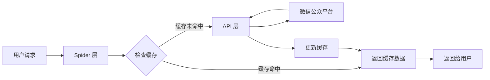
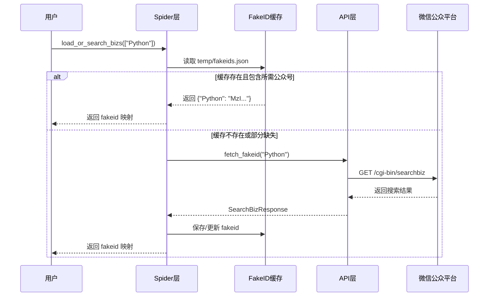
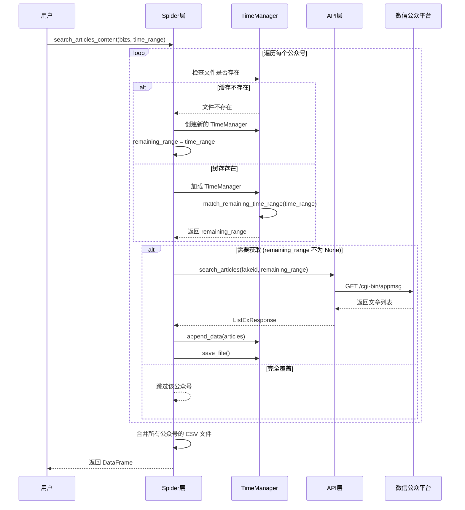
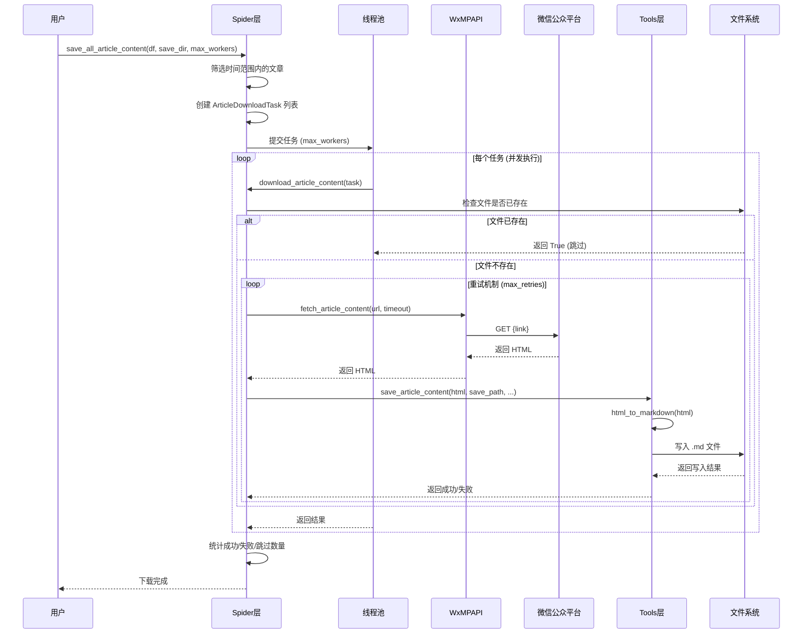
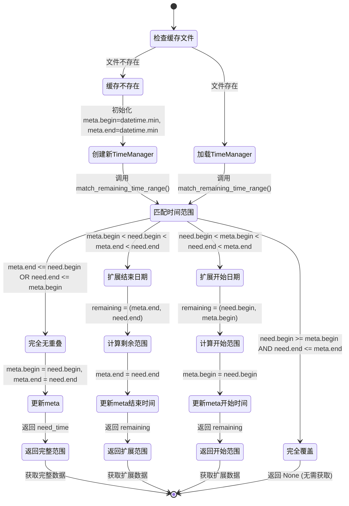
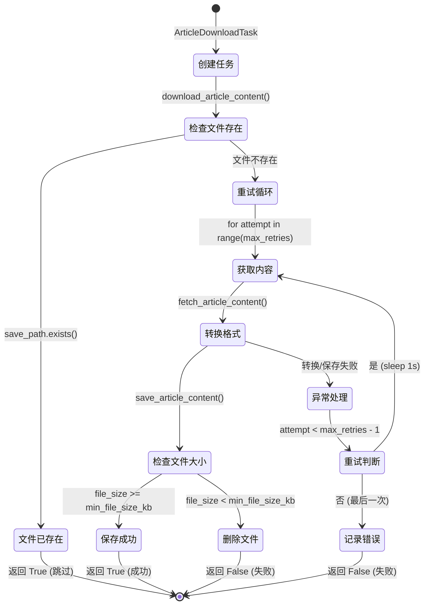
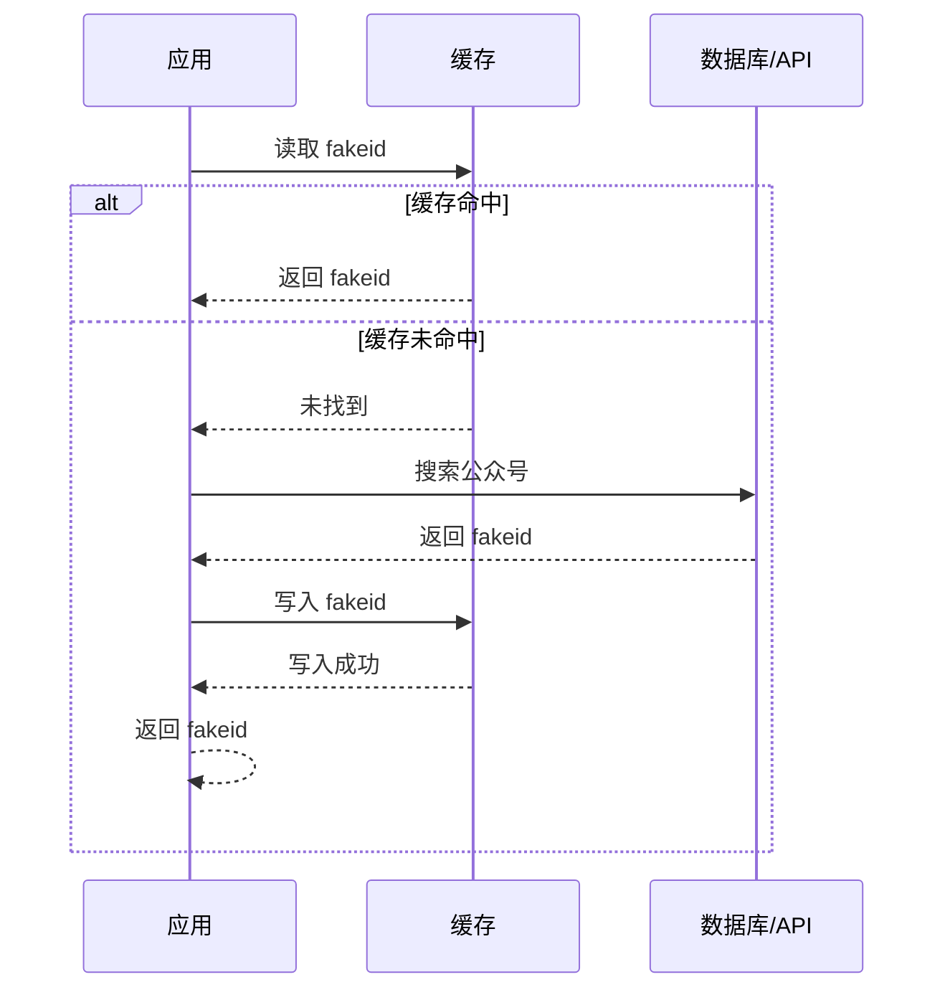
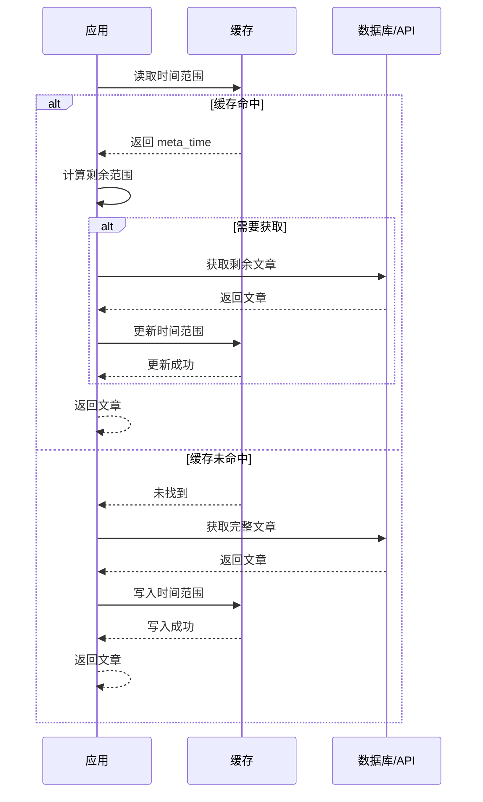
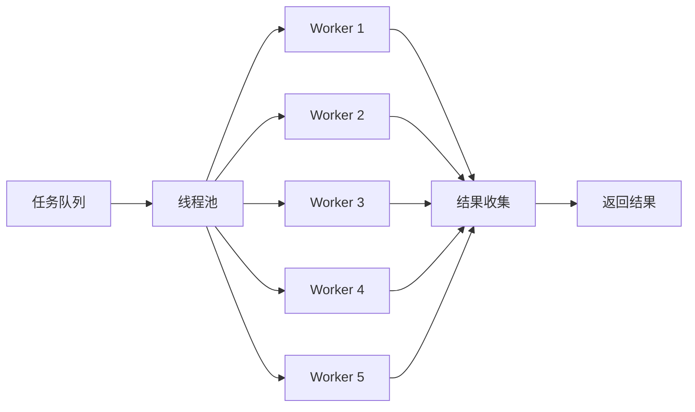
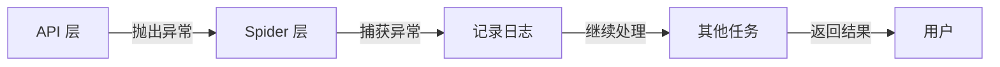

<!--
版本: 2.3.0
更新日期: 2026-03-03
状态: Published
-->

# 数据流动与状态管理

## 概述

本文档详细描述 `wxmp` 项目中的数据流动和状态管理机制，包括缓存策略、数据流转过程、状态转换等核心概念。

---

## 数据流动

### 1. 整体数据流


```mermaid
flowchart LR
    A[用户请求] --> B[Spider 层]
    B --> C{检查缓存}
    C -->|缓存命中| D[返回缓存数据]
    C -->|缓存未命中| E[API 层]
    E --> F[微信公众平台]
    F --> E
    E --> G[更新缓存]
    G --> D
    D --> H[返回给用户]
```

### 2. FakeID 获取流程


```mermaid
sequenceDiagram
    participant User as 用户
    participant Spider as Spider层
    participant Cache as FakeID缓存
    participant API as API层
    participant WxMP as 微信公众平台

    User->>Spider: load_or_search_bizs(["Python"])
    Spider->>Cache: 读取 temp/fakeids.json

    alt 缓存存在且包含所需公众号
        Cache-->>Spider: 返回 {"Python": "MzI..."}
        Spider-->>User: 返回 fakeid 映射
    else 缓存不存在或部分缺失
        Spider->>API: fetch_fakeid("Python")
        API->>WxMP: GET /cgi-bin/searchbiz
        WxMP-->>API: 返回搜索结果
        API-->>Spider: SearchBizResponse
        Spider->>Cache: 保存/更新 fakeid
        Spider-->>User: 返回 fakeid 映射
    end
```

**数据格式**:

```json
{
  "Python编程": "MzI...",
  "机器学习": "MzI...",
  "数据分析": "MzI..."
}
```

### 3. 文章列表获取流程


```mermaid
sequenceDiagram
    participant User as 用户
    participant Spider as Spider层
    participant TM as TimeManager
    participant API as API层
    participant WxMP as 微信公众平台

    User->>Spider: search_articles_content(bizs, time_range)

    loop 遍历每个公众号
        Spider->>TM: 检查文件是否存在

        alt 缓存不存在
            TM-->>Spider: 文件不存在
            Spider->>TM: 创建新的 TimeManager
            Spider->>Spider: remaining_range = time_range
        else 缓存存在
            Spider->>TM: 加载 TimeManager
            TM->>TM: match_remaining_time_range(time_range)
            TM-->>Spider: 返回 remaining_range
        end

        alt 需要获取 (remaining_range 不为 None)
            Spider->>API: search_articles(fakeid, remaining_range)
            API->>WxMP: GET /cgi-bin/appmsg
            WxMP-->>API: 返回文章列表
            API-->>Spider: ListExResponse
            Spider->>TM: append_data(articles)
            Spider->>TM: save_file()
        else 完全覆盖
            Spider-->>Spider: 跳过该公众号
        end
    end

    Spider->>Spider: 合并所有公众号的 CSV 文件
    Spider-->>User: 返回 DataFrame
```

**数据格式**:

```json
{
  "begin": "2024-01-01",
  "end": "2024-06-30"
}
```

```csv
title,link,create_time,cover,digest
文章标题1,https://mp.weixin.qq.com/s/xxx1,2024-01-01 10:00:00,https://...,摘要1
文章标题2,https://mp.weixin.qq.com/s/xxx2,2024-01-02 10:00:00,https://...,摘要2
```

### 4. 文章内容下载流程


```mermaid
sequenceDiagram
    participant User as 用户
    participant Spider as Spider层
    participant ThreadPool as 线程池
    participant API as WxMPAPI
    participant WxMP as 微信公众平台
    participant Tools as Tools层
    participant File as 文件系统

    User->>Spider: save_all_article_content(df, save_dir, max_workers)
    Spider->>Spider: 筛选时间范围内的文章
    Spider->>Spider: 创建 ArticleDownloadTask 列表
    Spider->>ThreadPool: 提交任务 (max_workers)

    loop 每个任务 (并发执行)
        ThreadPool->>Spider: download_article_content(task)
        Spider->>File: 检查文件是否已存在

        alt 文件已存在
            File-->>ThreadPool: 返回 True (跳过)
        else 文件不存在
            loop 重试机制 (max_retries)
                Spider->>API: fetch_article_content(url, timeout)
                API->>WxMP: GET {link}
                WxMP-->>API: 返回 HTML
                API-->>Spider: 返回 HTML
                Spider->>Tools: save_article_content(html, save_path, ...)
                Tools->>Tools: html_to_markdown(html)
                Tools->>File: 写入 .md 文件
                File-->>Tools: 返回写入结果
                Tools-->>Spider: 返回成功/失败
            end
        end

        ThreadPool-->>Spider: 返回结果
    end

    Spider->>Spider: 统计成功/失败/跳过数量
    Spider-->>User: 下载完成
```

**数据格式**:

```markdown
---
title: 文章标题
date: 2024-01-01
link: https://mp.weixin.qq.com/s/xxx
account: 公众号名
summary: 文章摘要
---

文章内容...


## 标题

内容...
```

---

## 状态管理

### 1. 缓存状态机


```mermaid
stateDiagram-v2
    [*] --> 检查缓存文件

    检查缓存文件 --> 缓存不存在: 文件不存在
    检查缓存文件 --> 加载TimeManager: 文件存在

    缓存不存在 --> 创建新TimeManager: 初始化 meta.begin=datetime.min, meta.end=datetime.min
    创建新TimeManager --> 匹配时间范围: 调用 match_remaining_time_range()

    加载TimeManager --> 匹配时间范围: 调用 match_remaining_time_range()

    匹配时间范围 --> 完全无重叠: meta.end <= need.begin OR need.end <= meta.begin
    匹配时间范围 --> 扩展结束日期: meta.begin < need.begin < meta.end < need.end
    匹配时间范围 --> 扩展开始日期: need.begin < meta.begin < need.end < meta.end
    匹配时间范围 --> 完全覆盖: need.begin >= meta.begin AND need.end <= meta.end

    完全无重叠 --> 更新meta: meta.begin = need.begin, meta.end = need.end
    更新meta --> 返回完整范围: 返回 need_time
    返回完整范围 --> [*]: 获取完整数据

    扩展结束日期 --> 计算剩余范围: remaining = (meta.end, need.end)
    计算剩余范围 --> 更新meta结束时间: meta.end = need.end
    更新meta结束时间 --> 返回扩展范围: 返回 remaining
    返回扩展范围 --> [*]: 获取扩展数据

    扩展开始日期 --> 计算开始范围: remaining = (need.begin, meta.begin)
    计算开始范围 --> 更新meta开始时间: meta.begin = need.begin
    更新meta开始时间 --> 返回开始范围: 返回 remaining
    返回开始范围 --> [*]: 获取扩展数据

    完全覆盖 --> [*]: 返回 None (无需获取)
```

### 2. 时间范围匹配算法

```python
def match_remaining_time_range(self, need_time: T) -> T | None:
    """
    时间范围匹配算法

    四种情况：
    1. 完全无重叠 → 返回完整请求范围，替换缓存
    2. 部分重叠（需要扩展结束） → 返回扩展部分，更新缓存结束时间
    3. 部分重叠（需要扩展开始） → 返回扩展部分，更新缓存开始时间
    4. 完全覆盖 → 返回 None，无需获取
    """
    # 情况 1: 完全无重叠 (meta.end <= need.begin OR need.end <= meta.begin)
    if self.meta.end <= need_time.begin or need_time.end <= self.meta.begin:
        self.meta.begin = need_time.begin
        self.meta.end = need_time.end
        return need_time

    # 情况 2: 需要扩展结束日期 (meta.begin < need.begin < meta.end < need.end)
    elif self.meta.begin < need_time.begin < self.meta.end < need_time.end:
        remaining_range = type(need_time)(begin=self.meta.end, end=need_time.end)
        self.meta.end = need_time.end
        return remaining_range

    # 情况 3: 需要扩展开始日期 (need.begin < meta.begin < need.end < meta.end)
    elif need_time.begin < self.meta.begin < need_time.end < self.meta.end:
        remaining_range = type(need_time)(begin=need_time.begin, end=self.meta.begin)
        self.meta.begin = need_time.begin
        return remaining_range

    # 情况 4: 完全覆盖 (need_time 在 meta 范围内)
    else:
        return None
```

**可视化示例**:

```
情况 1: 完全无重叠
meta_time: |====|
need_time:           |====|
remaining:           |====|
new_meta:            |====|

情况 2: 部分重叠（扩展结束）
meta_time: |====|
need_time:  |========|
remaining:      |====|
new_meta:  |========|

情况 3: 部分重叠（扩展开始）
meta_time:      |====|
need_time: |========|
remaining: |====|
new_meta: |========|

情况 4: 完全覆盖
meta_time: |========|
need_time:  |====|
remaining: None
new_meta: |========|
```

### 3. 下载任务状态


```mermaid
stateDiagram-v2
    [*] --> 创建任务: ArticleDownloadTask

    创建任务 --> 检查文件存在: download_article_content()

    检查文件存在 --> 文件已存在: save_path.exists()
    检查文件存在 --> 重试循环: 文件不存在

    文件已存在 --> [*]: 返回 True (跳过)

    重试循环 --> 获取内容: for attempt in range(max_retries)

    获取内容 --> 转换格式: fetch_article_content()

    转换格式 --> 检查文件大小: save_article_content()
    转换格式 --> 异常处理: 转换/保存失败

    检查文件大小 --> 保存成功: file_size >= min_file_size_kb
    检查文件大小 --> 删除文件: file_size < min_file_size_kb

    删除文件 --> [*]: 返回 False (失败)
    异常处理 --> 重试判断: attempt < max_retries - 1

    重试判断 --> 获取内容: 是 (sleep 1s)
    重试判断 --> 记录错误: 否 (最后一次)

    记录错误 --> [*]: 返回 False (失败)
    保存成功 --> [*]: 返回 True (成功)
```

---

## 缓存策略

### 1. Cache Aside 模式

**FakeID 缓存**:


```mermaid
sequenceDiagram
    participant App as 应用
    participant Cache as 缓存
    participant DB as 数据库/API

    App->>Cache: 读取 fakeid
    alt 缓存命中
        Cache-->>App: 返回 fakeid
    else 缓存未命中
        Cache-->>App: 未找到
        App->>DB: 搜索公众号
        DB-->>App: 返回 fakeid
        App->>Cache: 写入 fakeid
        Cache-->>App: 写入成功
        App-->>App: 返回 fakeid
    end
```

**时间范围缓存**:


```mermaid
sequenceDiagram
    participant App as 应用
    participant Cache as 缓存
    participant DB as 数据库/API

    App->>Cache: 读取时间范围
    alt 缓存命中
        Cache-->>App: 返回 meta_time
        App->>App: 计算剩余范围
        alt 需要获取
            App->>DB: 获取剩余文章
            DB-->>App: 返回文章
            App->>Cache: 更新时间范围
            Cache-->>App: 更新成功
        end
        App-->>App: 返回文章
    else 缓存未命中
        Cache-->>App: 未找到
        App->>DB: 获取完整文章
        DB-->>App: 返回文章
        App->>Cache: 写入时间范围
        Cache-->>App: 写入成功
        App-->>App: 返回文章
    end
```

### 2. 缓存文件结构

```
temp/
├── fakeids.json                          # FakeID 缓存
├── articles_info/                        # 文章信息目录
│   ├── Python编程.json                   # 时间范围缓存
│   ├── Python编程.csv                    # 文章列表
│   ├── 机器学习.json
│   └── 机器学习.csv
└── article_content/                      # 文章内容目录
    ├── Python编程/
    │   ├── 文章1.md
    │   ├── 文章2.md
    │   └── ...
    └── 机器学习/
        ├── 文章1.md
        └── ...
```

### 3. 缓存一致性

**写入策略**:
- 先写入临时文件
- 原子性重命名
- 避免写入过程中读取到不完整数据

**读取策略**:
- 读取前检查文件是否存在
- 验证文件格式是否正确
- 异常时回退到无缓存状态

---

## 数据模型

### 1. TimeRange

```python
class TimeRange(BaseModel):
    """文章时间范围，用于缓存管理"""
    begin: datetime
    end: datetime = datetime.today()

    @field_serializer("begin", "end")
    def serialize_datetime(self, dt: datetime) -> str:
        """将 datetime 对象序列化为 YYYY-MM-DD 格式字符串"""
        return dt.strftime("%Y-%m-%d")

    def __contains__(self, dt: datetime) -> bool:
        """判断时间是否在范围内（包含边界）"""
        return self.begin <= dt <= self.end
```

**状态转换**:

```
初始状态: begin=2024-01-01, end=2024-12-31
         ↓
扩展结束: begin=2024-01-01, end=2025-12-31
         ↓
扩展开始: begin=2023-01-01, end=2025-12-31
```

### 2. ArticleDownloadTask

```python
class ArticleDownloadTask(NamedTuple):
    """文章下载任务"""
    url: str                    # 文章链接
    title: str                  # 文章标题
    save_dir: Path              # 保存目录
    save_file: Literal["md", "html"] = "md"  # 保存格式
    max_retries: int = 3        # 最大重试次数
    timeout: int = 30           # 请求超时时间（秒）
    date_str: str = ""          # 发布日期字符串
    account_name: str = ""      # 公众号名称
    digest: str = ""            # 文章摘要
    min_file_size_kb: int = 3   # 最小文件大小（KB）
```

**任务状态**:

```
创建 → 检查文件 → 获取内容 → 转换格式 → 检查大小 → 完成
  ↓        ↓          ↓          ↓          ↓
 跳过    失败       失败       失败       失败
```

---

## 并发控制

### 1. 线程池模型


```mermaid
flowchart LR
    A[任务队列] --> B[线程池]
    B --> C[Worker 1]
    B --> D[Worker 2]
    B --> E[Worker 3]
    B --> F[Worker 4]
    B --> G[Worker 5]
    C --> H[结果收集]
    D --> H
    E --> H
    F --> H
    G --> H
    H --> I[返回结果]
```

### 2. 并发参数

| 参数 | 默认值 | 说明 |
|------|--------|------|
| max_workers | 5 | 最大并发数 |
| timeout | 30 | 单个请求超时时间（秒） |
| max_retries | 3 | 最大重试次数 |

### 3. 并发安全

- 每个任务独立处理
- 文件写入使用原子操作
- 避免共享状态

---

## 错误处理

### 1. 错误传播


```mermaid
flowchart LR
    A[API 层] -->|抛出异常| B[Spider 层]
    B -->|捕获异常| C[记录日志]
    C -->|继续处理| D[其他任务]
    D -->|返回结果| E[用户]
```

### 2. 错误恢复

- **Token 失效**: 重新获取 token
- **网络错误**: 自动重试（最多 3 次）
- **文件写入失败**: 删除临时文件，记录错误
- **数据解析失败**: 跳过该条数据，继续处理

---

## 性能优化

### 1. 缓存优化

- FakeID 缓存：避免重复搜索
- 时间范围缓存：避免重复获取
- 增量更新：只获取新数据

### 2. 并发优化

- 多线程并发下载
- 连接复用（Session）
- 异步获取文章内容

### 3. 数据处理优化

- 使用 Pandas 批量处理
- 去重和排序优化
- 内存友好设计

---

## 监控与日志

### 1. 关键指标

- 缓存命中率
- 下载成功率
- 平均下载时间
- 错误率

### 2. 日志记录

```python
from loguru import logger

logger.info(f"从缓存加载fakeids: {cache_file}")
logger.info(f"公众号 {nickname} 剩余时间范围 {remaining_range}")
logger.warning(f"公众号 {nickname} 没有获取到有效文章")
logger.error(f"获取文章内容失败: {task.title}, 错误: {e}")
```

---

## 相关文档

- [项目概览](./项目概览.md)
- [架构设计](./架构设计.md)
- [API 文档](./API文档.md)
- [使用指南](./使用指南.md)
