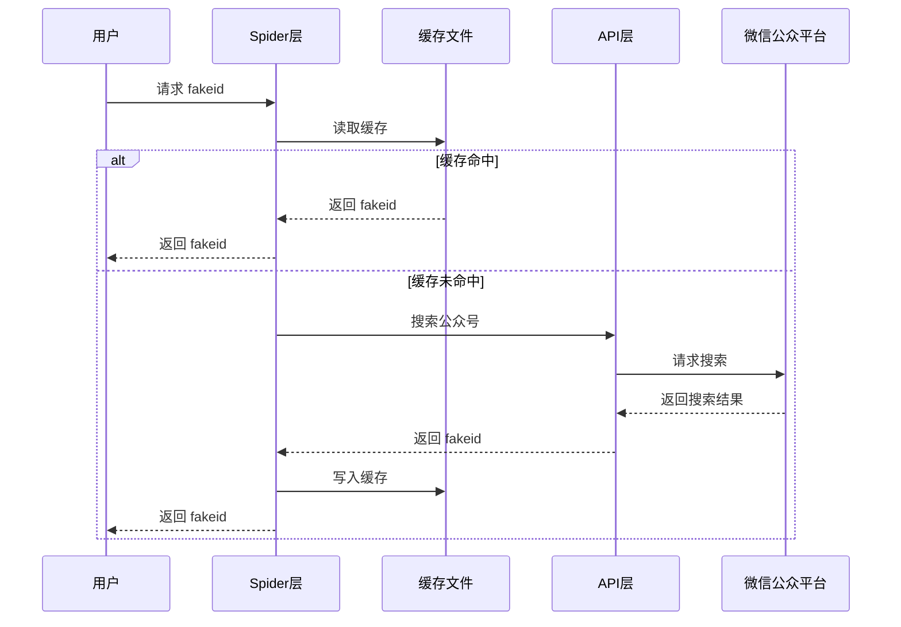
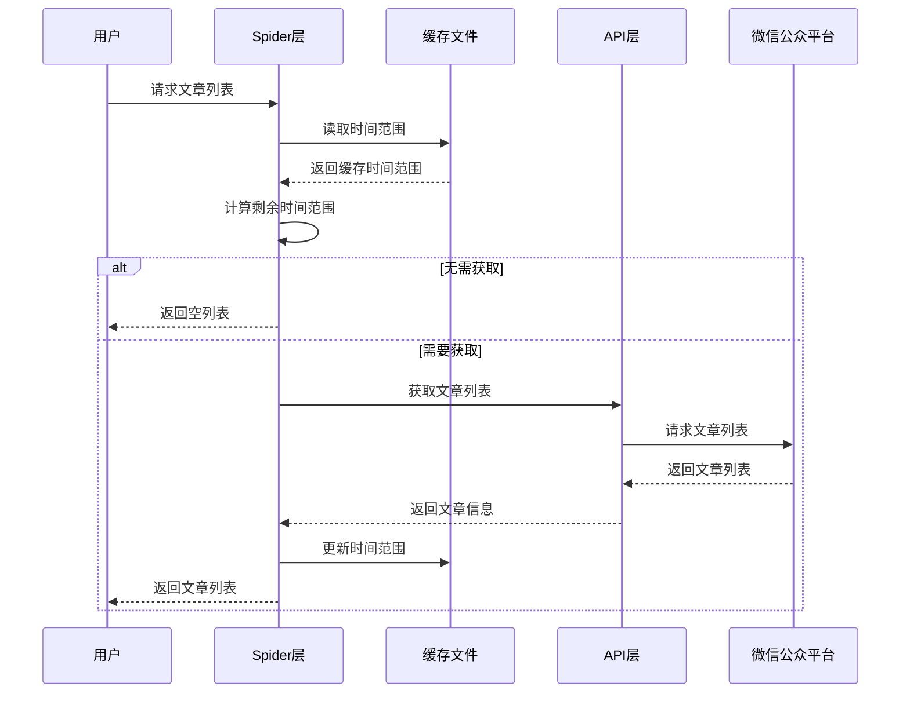

# 架构设计

## 设计原则

### 1. 分层架构

项目采用经典的三层架构设计：

```
┌─────────────────────────────────────┐
│         用户层 (User Layer)         │
│         用户代码 / 脚本              │
└──────────────┬──────────────────────┘
               │
┌──────────────▼──────────────────────┐
│      Spider 层 (Business Layer)     │
│    业务逻辑 / 缓存管理 / 并发控制    │
└──────────────┬──────────────────────┘
               │
┌──────────────▼──────────────────────┐
│       API 层 (Data Access Layer)    │
│    API 封装 / 请求处理 / 响应解析    │
└──────────────┬──────────────────────┘
               │
┌──────────────▼──────────────────────┐
│    微信公众平台 (External System)   │
└─────────────────────────────────────┘
```

### 2. 单一职责原则

- **API 层**: 只负责与微信公众平台交互
- **Spider 层**: 只负责业务逻辑和缓存管理
- **Tools 层**: 只提供通用工具函数

### 3. 开闭原则

- 对扩展开放：可以通过继承添加新功能
- 对修改封闭：核心 API 和工具保持稳定

### 4. 依赖倒置原则

- Spider 层依赖 API 层的抽象接口
- 用户代码依赖 Spider 层的抽象接口

## 模块设计

### API 层设计

#### 职责

1. 封装微信公众平台 API
2. 处理 HTTP 请求和响应
3. 数据模型验证（使用 Pydantic）
4. 异常处理

#### 核心类

```python
class WxMPAPI:
    """微信公众平台 API 主类"""

    def __init__(self, cookies: dict)
    def _fetch_token(self) -> str
    def fetch_fakeid(self, query: str, begin: int, count: int) -> SearchBizResponse
    def fetch_article_list(self, fakeid: str, begin: int, count: int) -> ListExResponse
    @staticmethod
    def is_valid_article_link(link: str) -> bool
    @staticmethod
    def fetch_article_content(link: str, timeout: int) -> str
```

#### 数据模型

```python
# 基础模型
class BaseRequest(BaseModel)
class BaseResp(BaseModel)
class BaseResponse(BaseModel)

# Token 相关
class TokenResponse(BaseModel)

# 公众号搜索
class SearchBizRequest(BaseModel)
class SearchBizResponse(BaseModel)
class AccountInfo(BaseModel)

# 文章列表
class ListExRequest(BaseModel)
class ListExResponse(BaseModel)
class ArticleListItem(BaseModel)
```

### Spider 层设计

#### 职责

1. 缓存管理（fakeid 缓存、时间范围缓存）
2. 业务逻辑封装
3. 并发控制
4. 数据处理和存储

#### 核心类

```python
class TimeRangeSpider(WxMPAPI):
    """时间范围爬虫"""

    def __init__(self, cookies: dict[str, str])
    @classmethod
    def from_cookies_file(cls, file_path: str) -> "TimeRangeSpider"
    def load_or_search_bizs(self, gzh_names: list[str], cache_file: Path) -> dict[str, str]
    def search_article_list(self, fakeid: str, begin: int, count: int) -> list[ArticleListItem]
    def search_articles(self, fakeid: str, max_count: int, time_range: TimeRange) -> list[ArticleListItem]
    def search_articles_content(self, bizs: dict[str, str], time_range: TimeRange, save_dir: Path) -> pd.DataFrame
    @staticmethod
    def download_article_content(task: ArticleDownloadTask) -> bool
    @staticmethod
    def save_all_article_content(df: pd.DataFrame, save_dir: Path, max_workers: int, time_range: TimeRange, save_file: str, min_file_size_kb: int)
```

#### 数据模型

```python
class TimeRange(BaseModel):
    """时间范围"""
    begin: datetime
    end: datetime

class ArticleDownloadTask(NamedTuple):
    """文章下载任务"""
    url: str
    title: str
    save_dir: Path
    save_file: Literal["md", "html"] = "md"
    max_retries: int = 3
    timeout: int = 30
    date_str: str = ""
    account_name: str = ""
    digest: str = ""
    min_file_size_kb: int = 3
```

### Tools 层设计

#### 职责

1. 文件操作
2. 文件名清理
3. 格式转换（HTML → Markdown）
4. 元数据生成

#### 核心函数

```python
# 文件操作
def load_json(file_path: Union[str, Path]) -> dict
def save_json(data: dict, file_path: Union[str, Path])
def load_html(file_path: Union[str, Path]) -> str
def save_html(html: str, file_path: Union[str, Path])
def load_markdown(file_path: Union[str, Path]) -> str
def save_markdown(markdown: str, file_path: Union[str, Path])

# 文件名清理
def sanitize_filename(filename: str, max_length: int = 200) -> str

# 文章处理
def generate_yaml_front_matter(title: str, date_str: str, link: str, account_name: str, digest: str) -> str
def save_article_content(html: str, save_path: Path, save_file: Literal["md", "html"], title: str, date_str: str, link: str, account_name: str, digest: str, min_file_size_kb: int) -> bool
def html_to_markdown(html: str) -> str
```

## 缓存策略

### 1. FakeID 缓存

**缓存文件**: `temp/fakeids.json`

**缓存策略**: Cache Aside



### 2. 时间范围缓存

**缓存文件**: `temp/articles_info/{公众号名}.json`

**缓存策略**: 增量更新



### 3. 时间范围匹配算法

```python
def match_remaining_time_range(
    meta_time: TimeRange, need_time: TimeRange
) -> tuple[TimeRange, TimeRange]:
    """
    时间范围匹配算法

    四种情况：
    1. 完全无重叠 → 返回完整请求范围
    2. 部分重叠（需要扩展结束） → 返回扩展部分
    3. 部分重叠（需要扩展开始） → 返回扩展部分
    4. 完全覆盖 → 返回 None
    """
```

## 并发设计

### 1. 文章下载并发

使用 `ThreadPoolExecutor` 实现并发下载：

```python
with ThreadPoolExecutor(max_workers=max_workers) as executor:
    futures = {
        executor.submit(download_article_content, task): task
        for task in tasks
    }
    for future in as_completed(futures):
        result = future.result()
```

### 2. 并发控制参数

- `max_workers`: 最大并发数（默认 5）
- `timeout`: 单个请求超时时间（默认 30 秒）
- `max_retries`: 最大重试次数（默认 3 次）

## 错误处理

### 1. 异常层次

```
Exception
├── WxMPAPIError (基础异常)
│   ├── TokenError (Token 获取失败)
│   ├── SearchBizError (搜索公众号失败)
│   └── ListExError (获取文章列表失败)
└── Exception (其他异常)
```

### 2. 错误处理策略

- **API 层**: 抛出特定异常，携带详细错误信息
- **Spider 层**: 捕获异常，记录日志，继续处理其他任务
- **用户层**: 根据业务需求决定是否继续

## 扩展点

### 1. 扩展 API 层

```python
class ExtendedAPI(WxMPAPI):
    def custom_api_method(self):
        pass
```

### 2. 扩展 Spider 层

```python
class CustomSpider(TimeRangeSpider):
    def custom_business_logic(self):
        pass
```

### 3. 扩展 Tools 层

```python
# tools/custom.py
def custom_tool():
    pass
```

## 性能优化

### 1. 缓存优化

- FakeID 缓存：避免重复搜索
- 时间范围缓存：避免重复获取

### 2. 并发优化

- 多线程并发下载
- 可配置并发数

### 3. 网络优化

- 连接复用（Session）
- 随机 User-Agent
- 请求超时控制

## 安全考虑

### 1. Cookie 管理

- Cookie 不应该硬编码在代码中
- 建议使用环境变量或配置文件

### 2. 请求频率

- 合理控制请求频率
- 避免被微信限制

### 3. 数据验证

- 使用 Pydantic 进行数据验证
- 防止注入攻击

## 测试策略

### 1. 单元测试

- 测试核心算法（如时间范围匹配）
- 测试工具函数

### 2. 集成测试

- 测试 API 调用
- 测试缓存逻辑

### 3. 测试覆盖率

- 目标覆盖率：> 80%
- 关键路径：100%
