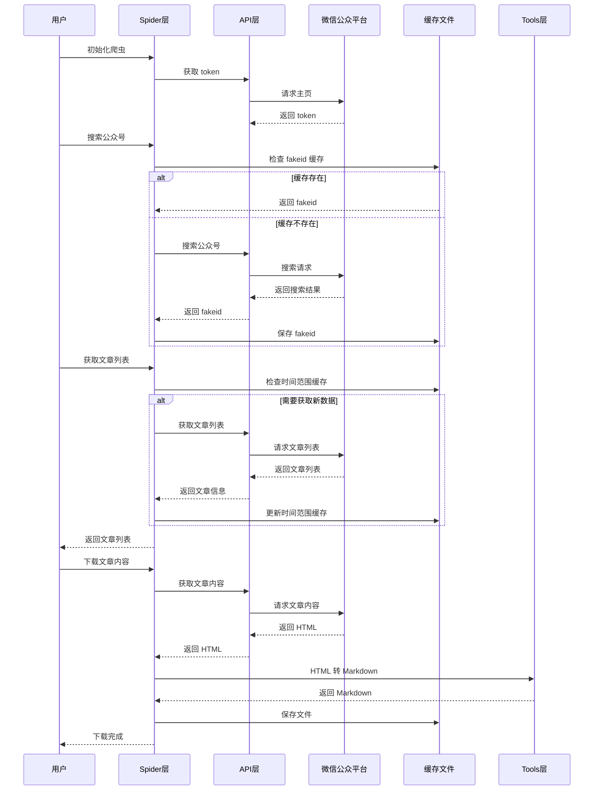
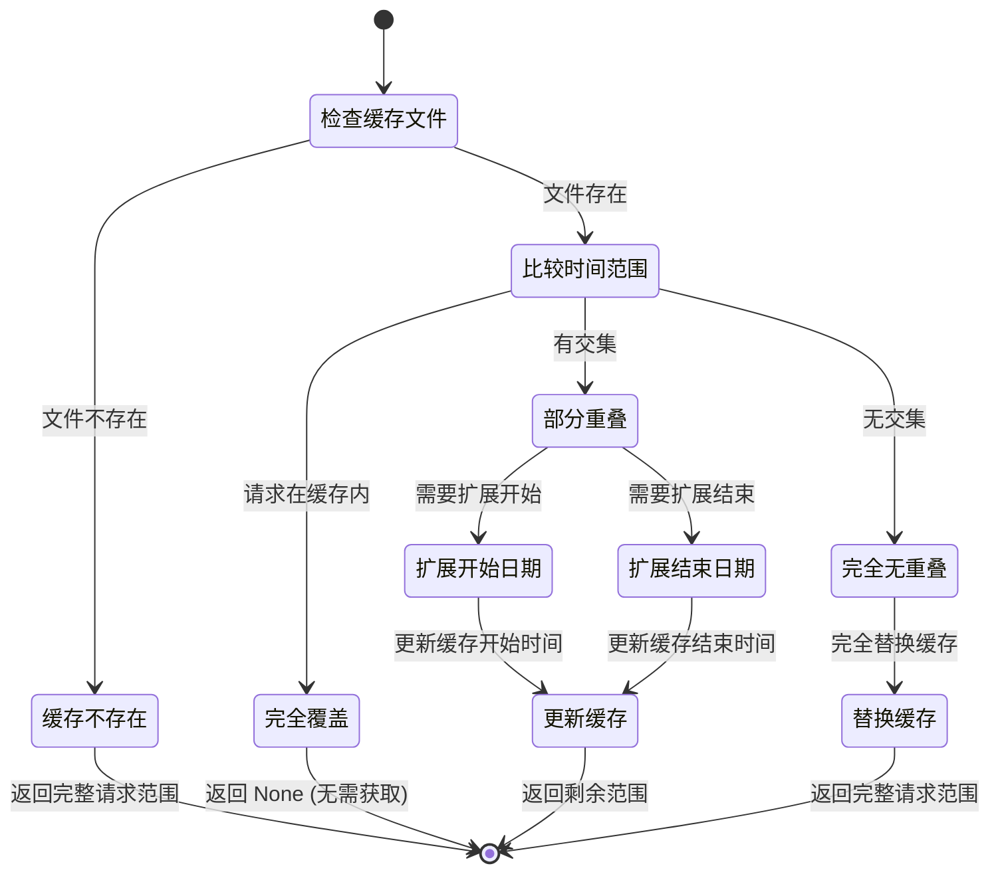

# 项目概览

## 项目简介

`wxmp` 是一个微信公众号 API 工具库，提供公众号搜索、文章列表获取、文章内容下载等功能。项目采用分层架构设计，支持缓存优化和并发下载。

**项目地址**: https://github.com/morning-start/wxmp

## 核心特性

- **API 封装**: 完整封装微信公众平台后台 API
- **缓存优化**: 支持时间范围缓存，避免重复获取
- **并发下载**: 支持多线程并发下载文章内容
- **格式转换**: 自动将 HTML 文章转换为 Markdown 格式
- **灵活扩展**: 用户可直接使用已有爬虫或基于 API 构建自定义爬虫

## 技术栈

| 技术 | 版本 | 用途 |
|------|------|------|
| Python | >= 3.10 | 开发语言 |
| Pydantic | >= 2.12.5 | 数据模型验证 |
| Requests | >= 2.32.5 | HTTP 请求 |
| Pandas | >= 2.3.3 | 数据处理 |
| Loguru | >= 0.7.3 | 日志记录 |
| tqdm | >= 4.67.3 | 进度条显示 |
| fake-useragent | >= 2.2.0 | 随机 User-Agent |

## 项目架构

```
wxmp/
├── src/wxmp/                    # 源码目录
│   ├── api/                     # API 层 - 基础 API 封装
│   │   ├── __init__.py         # API 导出
│   │   ├── common.py           # 公共模型和异常
│   │   ├── index.py            # WxMPAPI 主类
│   │   ├── token.py            # Token 获取
│   │   ├── search_biz.py       # 公众号搜索 API
│   │   └── list_ex.py           # 文章列表 API
│   ├── spider/                  # Spider 层 - 业务逻辑层
│   │   ├── __init__.py
│   │   └── time_range_spider.py # 时间范围爬虫
│   └── tools/                   # Tools 层 - 工具层
│       ├── __init__.py
│       ├── article.py           # 文章内容处理
│       └── file.py              # 文件操作工具
├── test/                        # 测试目录
│   └── test_time_range_spider.py
├── wiki/                        # 项目文档
├── pyproject.toml              # 项目配置
└── README.md                   # 项目说明
```

## 分层架构

### 1. API 层 (`api/`)

提供基础的 API 调用能力，封装微信公众平台的后台接口。

**核心类**:
- `WxMPAPI`: 主 API 类，提供所有基础 API 调用
- `TokenResponse`: Token 响应模型
- `SearchBizResponse`: 公众号搜索响应
- `ListExResponse`: 文章列表响应

**主要方法**:
- `_fetch_token()`: 获取访问 token
- `fetch_fakeid()`: 搜索公众号
- `fetch_article_list()`: 获取文章列表
- `fetch_article_content()`: 获取文章内容

### 2. Spider 层 (`spider/`)

基于 API 层构建的业务逻辑层，提供高级功能。

**核心类**:
- `TimeRangeSpider`: 时间范围爬虫，支持缓存优化
- `TimeRange`: 时间范围模型
- `ArticleDownloadTask`: 文章下载任务

**主要功能**:
- 公众号 fakeid 缓存管理
- 时间范围缓存优化
- 文章列表获取和过滤
- 并发下载文章内容

### 3. Tools 层 (`tools/`)

提供通用工具函数。

**主要功能**:
- 文件名清理
- JSON/HTML/Markdown 文件读写
- HTML 转 Markdown
- YAML front matter 生成

## 数据流动



## 状态管理

### 缓存状态



## 使用场景

### 场景 1: 直接使用 API

适合需要精细控制 API 调用的场景。

```python
from wxmp import WxMPAPI

api = WxMPAPI(cookies)
response = api.search_fakeid("Python")
```

### 场景 2: 使用已有爬虫

适合快速获取公众号文章的场景，支持缓存优化。

```python
from wxmp.spider import TimeRangeSpider

spider = TimeRangeSpider.from_cookies_file("cookies.json")
df = spider.search_articles_content(
    bizs={"公众号名": "fakeid"},
    time_range=TimeRange(begin=datetime(2024, 1, 1))
)
```

### 场景 3: 自定义爬虫

适合需要自定义业务逻辑的场景。

```python
from wxmp import WxMPAPI
from wxmp.spider import TimeRangeSpider

class CustomSpider(TimeRangeSpider):
    def custom_method(self):
        pass
```

## 扩展指南

### 1. 扩展 API 层

继承 `WxMPAPI` 类添加新的 API 方法：

```python
class ExtendedAPI(WxMPAPI):
    def custom_api_call(self, params):
        pass
```

### 2. 扩展 Spider 层

继承 `TimeRangeSpider` 类添加新的业务逻辑：

```python
class CustomSpider(TimeRangeSpider):
    def custom_search_logic(self):
        pass
```

### 3. 扩展 Tools 层

在 `tools/` 目录添加新的工具模块：

```python
# tools/custom.py
def custom_tool():
    pass
```

## 相关文档

- [架构设计](./架构设计.md)
- [API 文档](./API文档.md)
- [使用指南](./使用指南.md)
- [数据流动与状态管理](./数据流动与状态管理.md)
